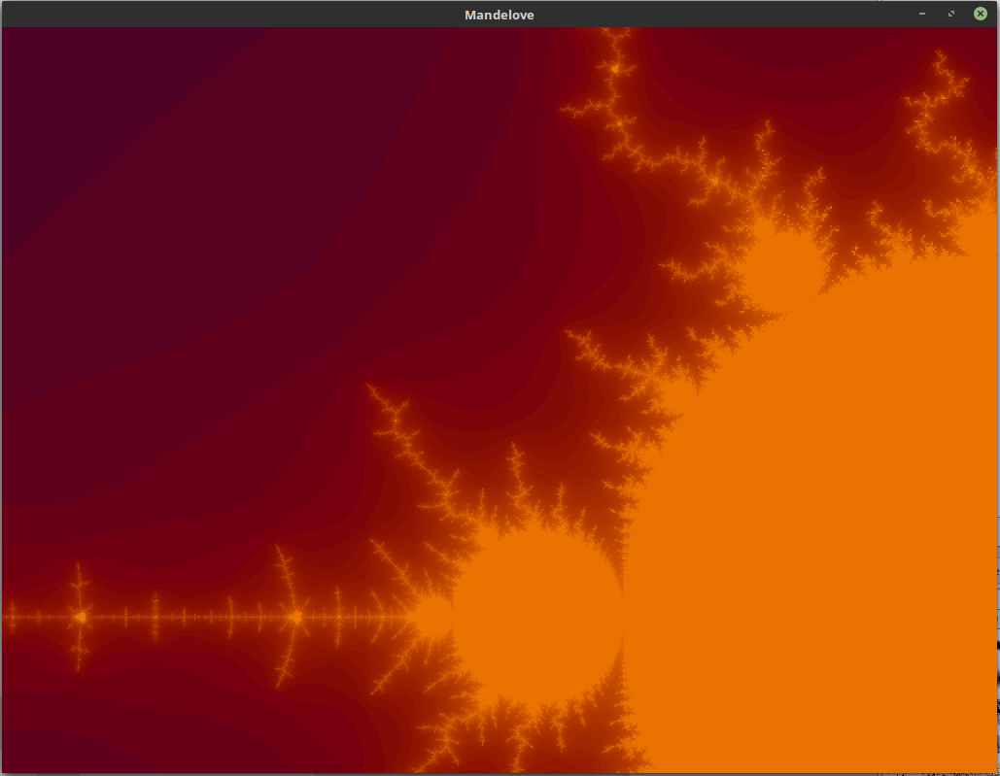

# ABOUT

This project implements Mandelbrot fractal renderer in Love2D framework. Other fractals can be easily implemented ("burning ship" fractal is commented out in code). Fractal can be explored by zooming in and out with mouse wheel.

Fractal formula is implemented in straight-forward way, evaluating number of evaluation cycles it takes for value to diverge.

To make rendering fast enough, some tricks are employed. Fractal is computed in iterations, first a low-res variant, then increasing resolution by factor of 2 for each cycle. While current iteration is computed and rendered, old iteration is kept as bitmap. When current iteration is done, it is merged into this bitmap and next iteration can begin.

The intensive computing is done inside Lua coroutine, employing cooperative multitasking. This way the interface can stay responsive during intensive calculations. For later hi-res iterations, there is some un-responsiveness, due to number of points needed to be rendered in each frame.

Note that this project is far from optimal. Turns out it's very expensive to draw point-by-point to screen. Better implementation would be to render into image and display it when it's done. Also, when zooming in there is significant loss of color contrast. I'm not sure if this is due to errors in implementation, or if I should adapt color palette dynamically. 